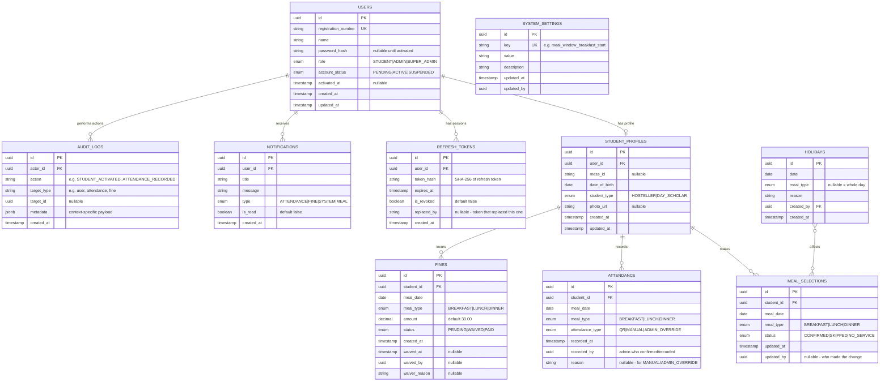
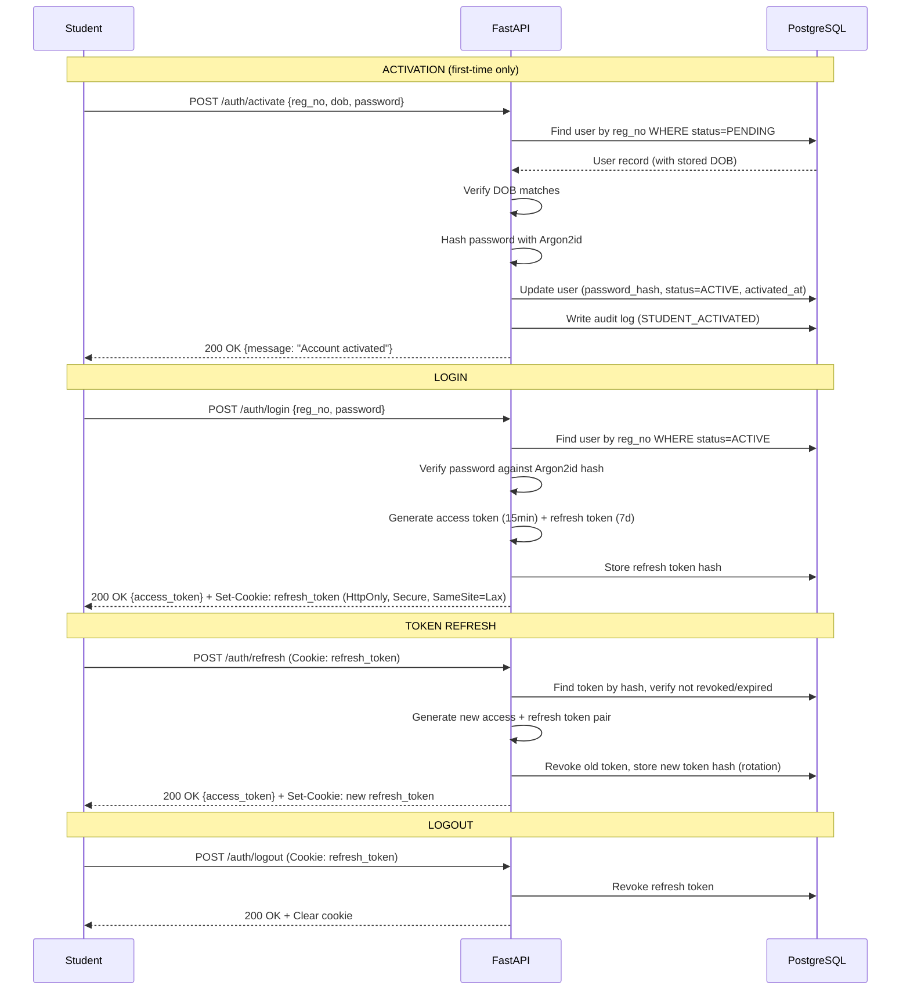
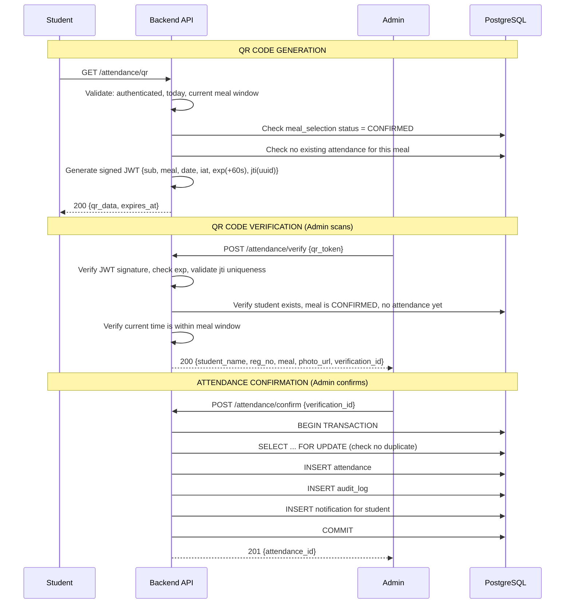
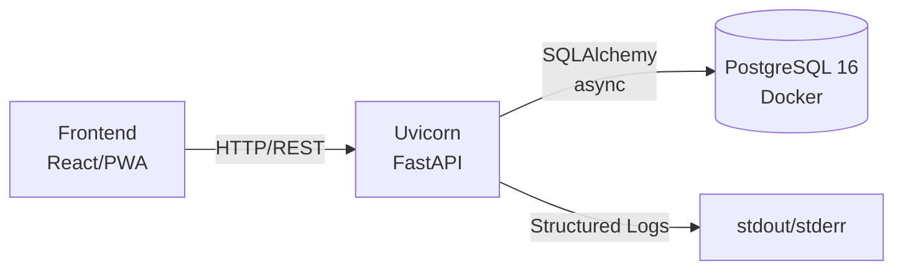

# CUSAT Boys Hostel Mess Management System — Architecture Document

> **Status:** DRAFT — Awaiting owner approval before Phase 1 begins.
> **Author:** Antigravity Agent (Phase 0)
> **Date:** 2026-08-08
> **System:** Backend REST API only. No frontend code.

---

## 1. Executive Summary

A production-ready backend API for managing daily mess operations (meal selection, QR-based attendance, fines, reports) for ~300 students in the CUSAT Boys Hostel. The system is a **modular monolith** built on FastAPI/PostgreSQL, designed for a single developer to maintain while scaling beyond 300 users without architectural changes.

The frontend (React/PWA, built separately) interacts exclusively through this documented REST API.

---

## 2. Environment Findings (Phase 0 Inspection)

| Resource | Found | Notes |
|---|---|---|
| Workspace | Empty `scratch/` directory | Clean start |
| Python | 3.11.9 | **Deviation:** Spec says 3.12+. 3.11 is fully compatible with all stack libraries. Decision: proceed on 3.11 unless owner installs 3.12+. |
| PostgreSQL | Not installed | Neither native nor Docker-accessible (daemon off). **Blocker for Phase 1.** |
| Docker | v29.4.3 installed | Daemon not running. Will use `docker-compose` for Postgres. |
| Git | v2.52.0 | Ready |
| pip | 26.0.1 | Ready |

### Environment Decisions

1. **Python 3.11 is acceptable.** All required libraries (FastAPI, SQLAlchemy 2.x, Pydantic v2, argon2-cffi, PyJWT) fully support 3.11. No 3.12-only features are needed.
2. **PostgreSQL via Docker Compose.** A `docker-compose.yml` will spin up Postgres 16 on port 5432. This keeps the dev machine clean and mirrors production.
3. **Test database:** A separate Postgres database (`cusat_mess_test`) in the same container for `pytest` isolation.
4. **SQLite will NOT be used**, even for testing — the system relies on Postgres-specific features (unique partial indexes, `JSONB` for audit metadata, `FOR UPDATE` row locking for attendance transactions).

---

## 3. Technology Stack (Locked)

| Layer | Technology | Version | Purpose |
|---|---|---|---|
| Language | Python | 3.11+ | Application code |
| Framework | FastAPI | 0.115+ | ASGI web framework, OpenAPI auto-generation |
| ORM | SQLAlchemy | 2.x (async) | Database access with type-annotated models |
| Migrations | Alembic | Latest | Schema versioning |
| Validation | Pydantic | v2 | Request/response schema validation |
| Password | argon2-cffi | Latest | Argon2id hashing |
| JWT | PyJWT | Latest | Access/refresh token signing |
| Server | Uvicorn | Latest | ASGI server |
| Database | PostgreSQL | 16 | Primary data store |
| Test runner | pytest + httpx | Latest | Unit + integration tests |
| Excel | openpyxl | Latest | Report generation |
| PDF | ReportLab | Latest | Report generation |
| Load test | Locust | Latest | Load testing |
| Containerization | Docker Compose | - | Dev environment (Postgres) |

**Explicitly excluded:** Redis, Kafka, Elasticsearch, Firebase, Supabase, microservices, Kubernetes, any paid API.

---

## 4. Project Structure

```
cusat-mess-backend/
├── docker-compose.yml          # Postgres 16 for dev + test
├── .env.example                # Template (never commit .env)
├── .gitignore
├── requirements.txt            # Pinned dependencies
├── requirements-dev.txt        # Test/dev dependencies (pytest, httpx, locust)
├── alembic.ini
├── README.md
│
├── app/
│   ├── __init__.py
│   ├── main.py                 # App factory — thin assembly only
│   ├── config.py               # Pydantic Settings (env-driven)
│   ├── database.py             # Async engine, session factory, get_db dependency
│   │
│   ├── models/                 # SQLAlchemy ORM models
│   │   ├── __init__.py
│   │   ├── base.py             # Declarative base, common mixins (TimestampMixin)
│   │   ├── user.py             # User, RefreshToken
│   │   ├── student.py          # StudentProfile
│   │   ├── meal.py             # MealSelection
│   │   ├── attendance.py       # Attendance
│   │   ├── fine.py             # Fine
│   │   ├── holiday.py          # Holiday
│   │   ├── notification.py     # Notification
│   │   ├── audit.py            # AuditLog
│   │   └── settings.py         # SystemSettings
│   │
│   ├── schemas/                # Pydantic v2 request/response models
│   │   ├── __init__.py
│   │   ├── common.py           # APIResponse envelope, pagination, error schemas
│   │   ├── auth.py
│   │   ├── user.py
│   │   ├── meal.py
│   │   ├── attendance.py
│   │   ├── fine.py
│   │   ├── holiday.py
│   │   ├── notification.py
│   │   ├── report.py
│   │   ├── audit.py
│   │   └── settings.py
│   │
│   ├── repositories/           # Data access layer (queries only — no business logic)
│   │   ├── __init__.py
│   │   ├── base.py             # Generic CRUD operations
│   │   ├── user_repo.py
│   │   ├── student_repo.py
│   │   ├── meal_repo.py
│   │   ├── attendance_repo.py
│   │   ├── fine_repo.py
│   │   ├── holiday_repo.py
│   │   ├── notification_repo.py
│   │   ├── audit_repo.py
│   │   └── settings_repo.py
│   │
│   ├── services/               # Business logic layer
│   │   ├── __init__.py
│   │   ├── auth_service.py     # Activation, login, token management
│   │   ├── meal_service.py     # Selection logic, cutoff enforcement
│   │   ├── meal_timing_service.py  # Centralized time windows + cutoffs
│   │   ├── attendance_service.py   # QR + manual + override + dedup
│   │   ├── qr_service.py          # QR token generation, verification, confirmation
│   │   ├── fine_service.py        # Fine creation, waiver, reconciliation
│   │   ├── holiday_service.py     # Holiday CRUD + cascade logic
│   │   ├── notification_service.py
│   │   ├── report_service.py      # Excel + PDF generation
│   │   ├── student_service.py     # Import, search, management
│   │   ├── audit_service.py       # Audit log writer (append-only)
│   │   └── settings_service.py    # System settings read/write
│   │
│   ├── routers/                # FastAPI route handlers (thin — delegate to services)
│   │   ├── __init__.py
│   │   ├── health.py
│   │   ├── auth.py
│   │   ├── student.py          # /me, /me/dashboard
│   │   ├── meals.py
│   │   ├── attendance.py
│   │   ├── notifications.py
│   │   ├── admin.py            # Admin-only routes
│   │   └── super_admin.py      # Super-admin-only routes
│   │
│   ├── security/               # Auth & RBAC
│   │   ├── __init__.py
│   │   ├── password.py         # Argon2id hashing
│   │   ├── jwt_handler.py      # Token creation/validation
│   │   ├── dependencies.py     # get_current_user, require_role, require_roles
│   │   └── rate_limiter.py     # In-memory sliding window (no Redis)
│   │
│   ├── middleware/
│   │   ├── __init__.py
│   │   ├── error_handler.py    # Global exception → JSON error envelope
│   │   ├── cors.py             # CORS configuration (env-driven, no wildcard + credentials)
│   │   └── logging_middleware.py   # Request/response structured logging
│   │
│   └── utils/
│       ├── __init__.py
│       ├── timezone.py         # Asia/Kolkata helpers — single source of "now"
│       ├── enums.py            # All enums (Role, MealType, MealStatus, etc.)
│       ├── exceptions.py       # Typed business exceptions with error codes
│       └── pagination.py       # Cursor/offset pagination helper
│
├── migrations/                 # Alembic migration scripts
│   ├── env.py
│   ├── script.py.mako
│   └── versions/
│
├── tests/
│   ├── conftest.py             # Fixtures: test DB, test client, auth helpers
│   ├── unit/
│   │   ├── test_cutoff.py
│   │   ├── test_meal_timing.py
│   │   ├── test_holiday_cascade.py
│   │   ├── test_fine_calc.py
│   │   ├── test_qr_token.py
│   │   └── test_rbac.py
│   ├── integration/
│   │   ├── test_auth_flow.py
│   │   ├── test_meal_selection.py
│   │   ├── test_attendance_flow.py
│   │   ├── test_fine_flow.py
│   │   ├── test_admin_ops.py
│   │   └── test_super_admin.py
│   └── security/
│       ├── test_qr_replay.py
│       ├── test_concurrent_attendance.py
│       ├── test_rbac_enforcement.py
│       ├── test_token_security.py
│       ├── test_rate_limiting.py
│       └── test_injection.py
│
├── scripts/
│   ├── seed_dev_data.py        # Seed development data (never real student data)
│   └── run_fine_reconciliation.py  # Standalone fine-generation script
│
├── locustfile.py               # Load test configuration
│
└── docs/
    ├── ARCHITECTURE.md         # This document
    ├── API.md                  # Endpoint reference (filled progressively)
    ├── FRONTEND_INTEGRATION.md # Frontend contract document
    └── LOAD_TESTING.md         # Load test results (filled in Phase 8)
```

---

## 5. Data Model

### 5.1 Entity-Relationship Overview



### 5.2 Critical Database Constraints

These constraints enforce business rules at the database level, not just application logic:

| Constraint | Table | Type | Purpose |
|---|---|---|---|
| `uq_meal_selection` | meal_selections | UNIQUE(student_id, meal_date, meal_type) | One selection per student per meal per day |
| `uq_attendance` | attendance | UNIQUE(student_id, meal_date, meal_type) | Structurally prevent duplicate attendance |
| `uq_fine` | fines | UNIQUE(student_id, meal_date, meal_type) | One fine per missed meal |
| `uq_holiday` | holidays | UNIQUE(date, meal_type) | Prevent duplicate holiday declarations |
| `uq_reg_number` | users | UNIQUE(registration_number) | One account per student |
| `uq_setting_key` | system_settings | UNIQUE(key) | One value per setting |
| `chk_fine_waiver` | fines | CHECK | waived_at/waived_by/waiver_reason must all be set together |

### 5.3 Index Strategy

| Index | Table | Columns | Purpose |
|---|---|---|---|
| `ix_meal_date` | meal_selections | (meal_date) | Dashboard queries for a given date |
| `ix_attendance_date` | attendance | (meal_date) | Admin attendance overview |
| `ix_fine_status` | fines | (status, student_id) | Pending fine lookups |
| `ix_audit_actor` | audit_logs | (actor_id, created_at DESC) | Audit trail queries |
| `ix_audit_target` | audit_logs | (target_type, target_id) | "What happened to entity X" queries |
| `ix_notification_user` | notifications | (user_id, is_read, created_at DESC) | Unread notification queries |
| `ix_refresh_user` | refresh_tokens | (user_id, is_revoked) | Active session lookups |

### 5.4 Primary Key Strategy

All tables use **UUID v4** primary keys (`uuid.uuid4()`). Rationale:
- No sequential ID leakage (IDOR prevention)
- Safe for distributed/sharded future scaling
- No auto-increment contention under high concurrency

---

## 6. Security Architecture

### 6.1 Authentication Flow



### 6.2 Token Design

| Token | Lifetime | Storage | Contains | Rotation |
|---|---|---|---|---|
| Access Token | 15 minutes | `Authorization: Bearer` header | user_id, role, iat, exp | Not rotated — reissued on refresh |
| Refresh Token | 7 days | HttpOnly cookie + DB hash | Opaque random 256-bit | Rotated on every use (old revoked) |

**Refresh token rotation** prevents token theft: if an attacker uses a stolen refresh token, the legitimate user's next refresh attempt will find a revoked token, triggering automatic revocation of the entire token family.

### 6.3 RBAC Model

```
STUDENT:
  - Own profile, dashboard, meal selections
  - Own attendance status, QR generation
  - Own notifications, own fine history

ADMIN:
  - Everything STUDENT can do for themselves
  - View/search all students
  - Record manual attendance, admin overrides
  - Manage fines (view, waive)
  - Manage holidays (CRUD)
  - Generate reports (Excel, PDF)
  - View audit logs
  - Verify/confirm QR attendance

SUPER_ADMIN:
  - Everything ADMIN can do
  - Import students (Excel)
  - Manage admin accounts (create, suspend)
  - System settings (meal windows, cutoff, fine amount, QR validity)
  - Role management
```

**Enforcement:** The `require_role()` / `require_roles()` FastAPI dependency is applied at the router level. Every protected route declares its required role. RBAC is never inferred from frontend UI state.

### 6.4 Rate Limiting

In-memory sliding window rate limiter (no Redis dependency):

| Endpoint | Limit | Window |
|---|---|---|
| `/auth/login` | 5 attempts | 15 minutes per IP |
| `/auth/activate` | 3 attempts | 15 minutes per IP |
| `/auth/refresh` | 10 requests | 1 minute per user |
| General API | 60 requests | 1 minute per user |

### 6.5 QR Security (Highest-Scrutiny Module)



**QR Token Payload:**
```json
{
  "sub": "student_user_id",
  "meal": "LUNCH",
  "date": "2026-08-08",
  "iat": 1754631300,
  "exp": 1754631360,
  "jti": "a1b2c3d4-uuid"
}
```

**Multi-layer replay protection:**
1. **Expiry (60s):** Token is useless after 60 seconds
2. **JTI uniqueness:** Each token has a unique ID; cannot be resubmitted
3. **DB uniqueness constraint:** `UNIQUE(student_id, meal_date, meal_type)` on attendance — even if application logic has a bug, the database prevents duplicates
4. **`SELECT ... FOR UPDATE`:** Row-level locking prevents race conditions from concurrent verification/confirmation

---

## 7. Business Rules — Detailed Semantics

### 7.1 Meal Timing (All times in Asia/Kolkata)

| Setting Key | Default | Description |
|---|---|---|
| `meal_window_breakfast_start` | 07:00 | Breakfast service opens |
| `meal_window_breakfast_end` | 09:30 | Breakfast service closes |
| `meal_window_lunch_start` | 12:00 | Lunch service opens |
| `meal_window_lunch_end` | 14:30 | Lunch service closes |
| `meal_window_dinner_start` | 19:00 | Dinner service opens |
| `meal_window_dinner_end` | 21:30 | Dinner service closes |
| `selection_cutoff_time` | 20:30 | Selection locks for next day's meals |
| `selection_cutoff_advance_days` | 1 | How many days before the meal date the cutoff applies |
| `default_meal_status` | CONFIRMED | Default status if student doesn't change |
| `fine_amount` | 30.00 | Fine per missed confirmed meal (₹) |
| `qr_validity_seconds` | 60 | QR token TTL |
| `timezone` | Asia/Kolkata | Server clock reference |

**All settings are stored in `system_settings` and read through `MealTimingService`** — never hardcoded in application logic.

### 7.2 Selection Cutoff Logic

```
Let target_date = the date of the meal.
Let cutoff_datetime = (target_date - selection_cutoff_advance_days) at selection_cutoff_time in Asia/Kolkata.
Let now = current server time in Asia/Kolkata.

If now >= cutoff_datetime → selection is LOCKED for target_date meals.
```

**Example:** With defaults (cutoff 20:30, advance 1 day):
- Meals on Aug 9 lock at Aug 8, 20:30 IST.
- At Aug 8, 20:29 IST → can still change Aug 9 meals.
- At Aug 8, 20:31 IST → Aug 9 meals locked, return `MEAL_SELECTION_LOCKED`.

**Edge case — holidays:** If a holiday is declared for a date, meal selections for that date are force-set to `NO_SERVICE`. Even if the cutoff hasn't passed, `NO_SERVICE` meals cannot be changed back by a student — only an admin can remove the holiday, which cascades the status back.

### 7.3 Fine Generation Logic

```
For each student, for each meal on a completed date:
  1. Was the meal CONFIRMED? No → no fine.
  2. Was the meal a holiday/NO_SERVICE? No → skip.
  3. Is there an attendance record? Yes → no fine.
  4. Has the meal window closed? No → not yet eligible.
  5. Does a fine already exist? Yes → skip (idempotent).
  6. → Generate fine (PENDING, ₹30).
```

Fine generation is triggered by:
- A scheduled reconciliation process (script/endpoint that runs after each meal window closes)
- Not real-time — runs on a periodic basis to catch all missed meals

### 7.4 Holiday Cascade

When a holiday is created:
1. All meal selections for that date (and optionally specific meal_type) are set to `NO_SERVICE`.
2. QR generation is blocked for those meals.
3. Fine generation skips `NO_SERVICE` meals.
4. Notifications sent to affected students.

When a holiday is deleted:
1. `NO_SERVICE` selections revert to `CONFIRMED` (the default) — this is a policy decision; assumption is that removing a holiday re-opens the meal.
2. Students can then opt out (set to `SKIPPED`) if cutoff hasn't passed.

> **Assumption surfaced:** Holiday deletion reverts meals to `CONFIRMED`. An alternative would be `SKIPPED` (safer for students). Awaiting owner decision.

---

## 8. API Design Conventions

### 8.1 Response Envelope

**Success:**
```json
{
  "success": true,
  "data": { ... },
  "meta": {
    "page": 1,
    "per_page": 20,
    "total": 156,
    "total_pages": 8
  }
}
```

**Error:**
```json
{
  "success": false,
  "error": {
    "code": "MEAL_SELECTION_LOCKED",
    "message": "Meal selection is locked after 8:30 PM for tomorrow's meals.",
    "details": null
  }
}
```

### 8.2 Error Codes (Machine-Readable)

| Code | HTTP Status | Meaning |
|---|---|---|
| `VALIDATION_ERROR` | 422 | Request body/params failed validation |
| `UNAUTHORIZED` | 401 | Missing or invalid credentials |
| `FORBIDDEN` | 403 | Valid credentials, insufficient role |
| `NOT_FOUND` | 404 | Resource doesn't exist |
| `ACCOUNT_NOT_FOUND` | 404 | Registration number not found |
| `ACCOUNT_ALREADY_ACTIVATED` | 409 | Trying to activate an already-active account |
| `INVALID_CREDENTIALS` | 401 | Wrong password or DOB |
| `ACCOUNT_SUSPENDED` | 403 | Suspended account attempting login |
| `MEAL_SELECTION_LOCKED` | 409 | Past cutoff time |
| `MEAL_NOT_FOUND` | 404 | No meal selection for that date/type |
| `ATTENDANCE_ALREADY_RECORDED` | 409 | Duplicate attendance attempt |
| `ATTENDANCE_UNAVAILABLE` | 409 | Outside meal window or meal not confirmed |
| `MEAL_SKIPPED` | 409 | Attempting QR for a skipped meal |
| `QR_EXPIRED` | 401 | QR token past expiry |
| `QR_INVALID` | 401 | QR token signature invalid or malformed |
| `QR_REPLAY_DETECTED` | 409 | JTI already used |
| `HOLIDAY_CONFLICT` | 409 | Meal is on a holiday |
| `FINE_ALREADY_EXISTS` | 409 | Duplicate fine |
| `FINE_NOT_WAIVABLE` | 409 | Fine not in PENDING status |
| `RATE_LIMIT_EXCEEDED` | 429 | Too many requests |
| `IMPORT_VALIDATION_ERROR` | 422 | Import file has errors (details contain per-row errors) |
| `INTERNAL_ERROR` | 500 | Unexpected server error (no stack trace leaked) |

### 8.3 Date & Time Conventions

- **All dates** in API responses: ISO 8601 (`YYYY-MM-DD`)
- **All timestamps** in API responses: ISO 8601 with timezone (`2026-08-08T12:30:00+05:30`)
- **Server clock** is the single source of truth for all time-sensitive logic
- **Client-supplied timestamps** are never trusted for business logic
- **Timezone:** `Asia/Kolkata` (UTC+5:30), configurable via system settings

### 8.4 Pagination

Offset-based pagination for admin list endpoints:
```
GET /api/v1/admin/students?page=1&per_page=20&search=john&sort=name&order=asc
```

### 8.5 API Versioning

All endpoints under `/api/v1/`. Version is in the URL path for clarity.

---

## 9. Cross-Cutting Concerns

### 9.1 Logging

Structured JSON logging via Python `logging` with correlation IDs:
```json
{
  "timestamp": "2026-08-08T12:30:00+05:30",
  "level": "INFO",
  "request_id": "uuid",
  "user_id": "uuid",
  "method": "POST",
  "path": "/api/v1/auth/login",
  "status": 200,
  "duration_ms": 45
}
```

**Never log:** passwords, tokens, full request bodies containing secrets, student personal data beyond IDs.

### 9.2 CORS

Configured via environment variables:
```
CORS_ORIGINS=http://localhost:3000,https://mess.cusat.ac.in
CORS_ALLOW_CREDENTIALS=true
```

**Never:** `Access-Control-Allow-Origin: *` with `credentials: true`.

### 9.3 Audit Trail

Every state-changing operation writes to `audit_logs`:
- Actor (who), action (what), target (on what), metadata (context), timestamp (when)
- Append-only — no UPDATE or DELETE on audit_logs
- Queryable by actor, target, action type, date range

### 9.4 Error Handling

Global exception handler catches all exceptions and returns the standard error envelope:
- `BusinessException` subclasses → mapped to specific HTTP codes and error codes
- `ValidationError` (Pydantic) → 422 with field-level details
- Unhandled exceptions → 500 with generic message (stack trace logged server-side, never sent to client)

---

## 10. Deployment Architecture (Dev)



**Dev environment:**
- `docker-compose up -d` starts PostgreSQL
- `alembic upgrade head` applies migrations
- `uvicorn app.main:app --reload` runs the dev server
- `pytest` runs against a separate test database

---

## 11. Open Questions for Owner

1. **Python 3.11 vs 3.12+:** Python 3.11.9 is the only version installed. All stack libraries are fully compatible. Proceed with 3.11, or should I wait for you to install 3.12+?

2. **Holiday deletion → meal status revert:** When a holiday is removed, should affected meal selections revert to `CONFIRMED` (re-opens the meal, student may get fined if they miss it) or `SKIPPED` (safer for the student, they must explicitly re-confirm)?

3. **Default meal status for new days:** When a new day rolls around and no selection exists, is the default `CONFIRMED` (student eats unless they opt out) or `SKIPPED` (student must opt in)? The spec says default `CONFIRMED` — confirming this is intentional as it means students must actively skip meals to avoid fines.

4. **Fine reconciliation trigger:** Should fine generation run:
   - (a) Automatically after each meal window closes (via a background task/cron within the app), or
   - (b) Via a manually-triggered admin endpoint, or
   - (c) Via an external cron job calling a script?
   I propose **(c)** — a standalone script callable by OS cron or manual trigger, keeping the API server stateless.

5. **Student import format:** The Excel import for super-admin — what columns are expected? I'll assume: `registration_number, name, date_of_birth, student_type, mess_id`. Confirm or adjust.

6. **Access token delivery:** The spec mentions "prefer HttpOnly cookies for browser use" for refresh tokens. For the **access token**, should it be:
   - (a) Returned in the JSON response body (frontend stores in memory, sends via `Authorization: Bearer` header), or
   - (b) Also set as an HttpOnly cookie?
   I recommend **(a)** — access token in response body, refresh token in HttpOnly cookie. This is the standard secure pattern.

7. **Docker Desktop:** The Docker daemon is not running. Should I include a `docker-compose.yml` and assume you'll start Docker Desktop before Phase 1, or should I adapt for a different PostgreSQL setup?

---

## 12. Assumptions Made (Will Proceed Unless Corrected)

| # | Assumption | Rationale |
|---|---|---|
| A1 | Python 3.11 is acceptable | All libraries support it; no 3.12-only features needed |
| A2 | Default meal status is CONFIRMED | Matches spec "confirmed unless skipped" |
| A3 | Holiday deletion reverts to CONFIRMED | Re-opens the meal for attendance |
| A4 | Fine reconciliation via external script | Keeps API server stateless |
| A5 | QR validity is 60 seconds | Spec default; configurable via settings |
| A6 | Access token in response body, refresh in HttpOnly cookie | Standard secure SPA pattern |
| A7 | Import columns: reg_no, name, dob, student_type, mess_id | Common student data fields |
| A8 | `async` SQLAlchemy with `asyncpg` driver | Best performance for FastAPI |
| A9 | UUIDs for all primary keys | IDOR prevention, future-proof |
| A10 | No email/SMS notifications | Not in spec; notifications are in-app only |

---

## 13. Verification Criteria per Phase

| Phase | Verification |
|---|---|
| 0 | This document approved |
| 1 | `docker-compose up` runs Postgres, `alembic upgrade head` succeeds, `GET /health` returns 200 in browser |
| 2 | `pytest tests/unit/test_auth.py tests/integration/test_auth_flow.py` all pass; Swagger shows auth endpoints |
| 3 | Meal selection + cutoff tests pass; dashboard endpoint returns correct data |
| 4 | QR generation → verify → confirm flow works end-to-end; security tests (replay, expiry, concurrency) pass |
| 5 | Fine generation after missed meals; waiver flow; all fine tests pass |
| 6 | Admin dashboard, student search, Excel/PDF download, holiday CRUD, audit log viewing — all tested |
| 7 | Student import with validation, admin management, settings CRUD — all tested |
| 8 | Full test suite green, load test results documented, docs finalized, no secrets committed |
